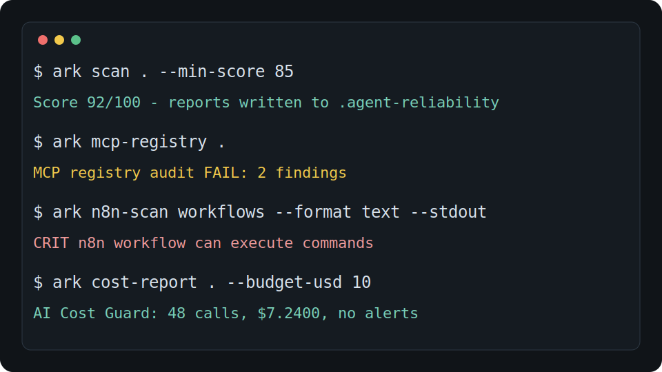

# Agent Reliability Kit

Verify, harden, and ship AI-agent-assisted codebases in one command.

[](docs/release-readiness.md)
[](https://github.com/aolingge/agent-reliability-kit/actions/workflows/ci.yml)
[](LICENSE)
[](package.json)

Agent Reliability Kit scans a repository the way a careful maintainer would before letting AI coding agents work there: agent instructions, verification commands, README quality, secret hygiene, GitHub Actions safety, MCP/tooling risk, n8n workflow exports, team policy, and release readiness.

The flagship path is simple: keep `agent-secret-guard` as the sharp security wedge, and use `agent-reliability-kit` as the one command center for agent-era repository reliability.

## Quick Start

- Source: <https://github.com/aolingge/agent-reliability-kit>
- npm: <https://www.npmjs.com/package/agent-reliability-kit>
- Docs: <https://aolingge.github.io/agent-reliability-kit/>

```bash
npx agent-reliability-kit scan . --out .agent-reliability --format markdown,json,html
```

Run from source when contributing:

```bash
npm install
npm run build
node dist/cli.js scan . --out .agent-reliability --format markdown,json,html
```

Optional focused checks:

```bash
ark team-audit . --out .agent-reliability/team
ark mcp-registry . --registry .agent-reliability/mcp-registry.json
ark n8n-scan . --out .agent-reliability/n8n
ark n8n-backup . --backup-dir .agent-reliability/n8n-backup
ark cost-report . --trace .agent-reliability/traces --budget-usd 10
ark text-audit AGENTS.md --profile agents-md --format markdown
```

The scan writes:

- `.agent-reliability/report.md`
- `.agent-reliability/report.json`
- `.agent-reliability/report.html`

The quick start runs entirely on your machine. Do not include real secrets, private logs, cookies, browser profiles, or private URLs in examples, fixtures, bug reports, or shared scan output.

## Why It Exists

AI coding agents fail most often on the unglamorous parts: missing repo rules, unclear commands, conflicting instruction files, unsafe CI defaults, accidental secret exposure, and README promises nobody has replayed. This project turns those weak signals into one shareable report.

## What It Checks

| Area | What gets verified |
| --- | --- |
| Agent instructions | `AGENTS.md`, `CLAUDE.md`, `GEMINI.md`, `CODEX.md`, Copilot instructions |
| Commands | test, build, lint, typecheck, check scripts across common stacks |
| README | install path, quick start, visual proof, license, contribution path |
| Secrets | token-like values, tracked `.env` files, redacted evidence |
| GitHub Actions | validation commands, explicit permissions, risky triggers, pipe-to-shell |
| AI tooling | MCP command configs and prompt-injection-like instruction files |
| Runbooks | debugging, verification, rollback, and reporting evidence |
| Shell safety | unguarded destructive or publishing commands in docs and scripts |
| Memory rules | trigger, behavior, exception, and secret-boundary signals in reusable rule files |
| MCP registry | private allowlist, trust score, approved commands/URLs, risk owner |
| n8n | public webhooks, command nodes, risky code nodes, workflow secrets, redacted backups |
| Team layer | scan history, policy gates, audit report, dry-run Slack payload |
| Cost guard | local trace token/cost summary and budget alerts |
| Text audit profiles | focused checks from retired small CLI tools, including AGENTS.md, PR briefs, task scopes, MCP READMEs, Skill files, changelogs, Windows paths, and repo onboarding notes |

## CLI

```bash
agent-reliability-kit scan [path]
agent-reliability-kit doctor [path]
agent-reliability-kit init [path]
agent-reliability-kit team-audit [path]
agent-reliability-kit mcp-registry [path]
agent-reliability-kit n8n-scan [path]
agent-reliability-kit n8n-backup [path]
agent-reliability-kit cost-report [path]
agent-reliability-kit text-audit FILE_OR_DIR --profile NAME
```

Examples:

```bash
ark scan . --min-score 85
ark scan . --format sarif --stdout > agent-reliability.sarif
ark doctor .
ark init .
ark team-audit .
ark mcp-registry .
ark n8n-scan .
ark cost-report . --budget-usd 10
ark text-audit AGENTS.md --profile agents-md --format markdown
ark text-audit . --profile mcp-readme --format json
```

Machine-readable stdout stays clean for CI:

```bash
ark scan . --format sarif --stdout > agent-reliability.sarif
```

## Report Preview


The HTML report is designed for maintainers, contributors, and launch pages. It gives a score, severity counts, repository signals, and next actions for each finding.

## Product Modules

- [Team audit layer](docs/team-layer.md): scan history, policy checks, audit report, and local Slack payload.
- [Private MCP registry](docs/private-mcp-registry.md): team allowlist with trust score, approved commands/URLs, permissions, owner, and reason.
- [n8n safety and backup](docs/n8n-safety-backup.md): risky workflow scanning and redacted Git-friendly backups.
- [AI cost guard](docs/ai-cost-guard.md): local trace cost summaries and budget alerts.
- Text audit profiles: consolidated compatibility profiles from small single-purpose tools such as `agents-md-doctor`, `agent-ci-doctor`, `mcp-readme-score`, `skill-md-lint`, and related repo/PR/task checks.
- [Commercial support path](docs/commercial-support.md): open-source boundary and future paid team features.
- [Consolidation roadmap](docs/roadmap-consolidation.md): how small tools roll into the flagship CLI.



## Comparisons

- [agent-secret-guard vs gitleaks](docs/comparisons/agent-secret-guard-vs-gitleaks.md)
- [Agent Reliability Kit vs generic linters](docs/comparisons/agent-reliability-kit-vs-generic-linters.md)

## Launch Kit

The repository includes a launch kit so maintainers can prepare public posts, demos, and replies without inventing copy or sharing private data at the last minute.

- [Launch plan](docs/launch/launch-plan.md)
- [Channel copy](docs/launch/channel-copy.md)
- [Demo script](docs/launch/demo-script.md)
- [Press kit](docs/launch/press-kit.md)
- [Community responses](docs/launch/community-responses.md)
- [Channel rules](docs/launch/channel-rules.md)
- [Distribution checklist](docs/launch/distribution-checklist.md)
- [Demo GIF script](docs/launch/demo-gif-script.md)
- [Product Hunt draft](docs/launch/product-hunt.md)
- [DEV article draft](docs/launch/devto-article.md)

Visual assets are available in `assets/`, including `social-preview.png` for GitHub/social cards and `product-hunt-thumbnail.png` for square launch surfaces.

## Product Principles

- Local-first: source code and findings stay on your machine.
- No secret echo: token-like evidence is redacted before it appears in reports.
- Private-data safe: reports, examples, and issues must not include real secrets, private logs, cookies, browser profiles, or private URLs.
- Agent-neutral: useful for Codex, Claude Code, Cursor, Gemini CLI, OpenCode, and similar tools.
- CI-friendly: Markdown, JSON, SARIF, and GitHub Actions annotations are first-class outputs.
- Maintainer-friendly: findings explain why they matter and what to do next.

## Development

```bash
npm install
npm run check
npm run build
npm run smoke
```

Repository layout:

```text
src/
  cli.ts
  core/
  scanners/
  report/
  init/
tests/
  fixtures/
docs/
assets/
```

## Roadmap

- v0.1: CLI scan, doctor, init, Markdown/JSON/HTML/SARIF reports.
- v0.2: team audit, private MCP registry, n8n safety/backup, and local cost guard.
- v0.3: GitHub Action wrapper, dogfood gallery, and `agent-secret-guard` rule-pack consolidation.
- v0.4: hosted team dashboard prototype, org policy packs, and private MCP approval workflow.
- v0.5: `pr verify`, `trace run`, and compatibility matrix for Codex, Claude Code, Cursor, Gemini CLI, and OpenCode.

## Security

Do not include real secrets in issues, examples, or fixtures. See [SECURITY.md](SECURITY.md) for reporting guidance.

## Contributing

Small, well-tested contributions are welcome. Start with [CONTRIBUTING.md](CONTRIBUTING.md), run `npm run check`, and include the scanner output when changing rules.

## License

MIT
