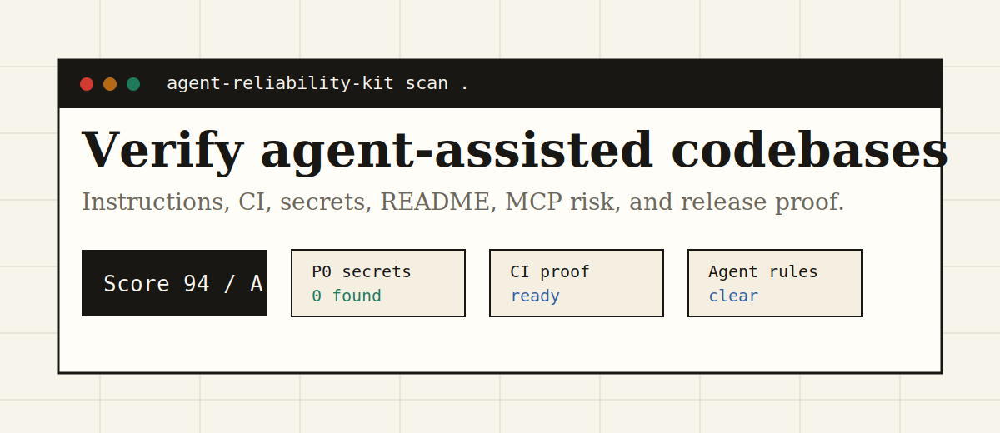
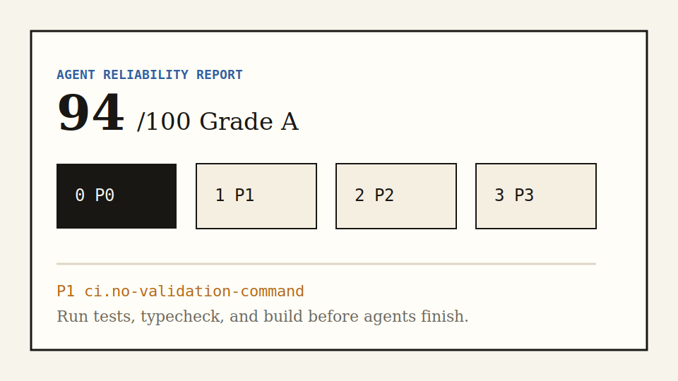

# Agent Reliability Kit

Verify, harden, and ship AI-agent-assisted codebases in one command.

[](https://github.com/aolingge/agent-reliability-kit/actions/workflows/ci.yml)
[](LICENSE)
[](package.json)

Agent Reliability Kit scans a repository the way a careful maintainer would before letting AI coding agents work there: agent instructions, verification commands, README quality, secret hygiene, GitHub Actions safety, MCP/tooling risk, and release readiness.

## Quick Start

```bash
npm install
npm run build
node dist/cli.js scan . --out .agent-reliability --format markdown,json,html
```

After npm publication:

```bash
npx agent-reliability-kit scan .
```

The scan writes:

- `.agent-reliability/report.md`
- `.agent-reliability/report.json`
- `.agent-reliability/report.html`

The quick start runs entirely on your machine. Do not include real secrets, private logs, cookies, browser profiles, or private URLs in examples, fixtures, bug reports, or shared scan output.

## Why It Exists

AI coding agents fail most often on the unglamorous parts: missing repo rules, unclear commands, conflicting instruction files, unsafe CI defaults, accidental secret exposure, and README promises nobody has replayed. This project turns those weak signals into one shareable report.

## What It Checks

| Area | What gets verified |
| --- | --- |
| Agent instructions | `AGENTS.md`, `CLAUDE.md`, `GEMINI.md`, `CODEX.md`, Copilot instructions |
| Commands | test, build, lint, typecheck, check scripts across common stacks |
| README | install path, quick start, visual proof, license, contribution path |
| Secrets | token-like values, tracked `.env` files, redacted evidence |
| GitHub Actions | validation commands, explicit permissions, risky triggers, pipe-to-shell |
| AI tooling | MCP command configs and prompt-injection-like instruction files |

## CLI

```bash
agent-reliability-kit scan [path]
agent-reliability-kit doctor [path]
agent-reliability-kit init [path]
```

Examples:

```bash
ark scan . --min-score 85
ark scan . --format sarif --stdout > agent-reliability.sarif
ark doctor .
ark init .
```

## Report Preview



The HTML report is designed for maintainers, contributors, and launch pages. It gives a score, severity counts, repository signals, and next actions for each finding.

## Product Principles

- Local-first: source code and findings stay on your machine.
- No secret echo: token-like evidence is redacted before it appears in reports.
- Private-data safe: reports, examples, and issues must not include real secrets, private logs, cookies, browser profiles, or private URLs.
- Agent-neutral: useful for Codex, Claude Code, Cursor, Gemini CLI, OpenCode, and similar tools.
- CI-friendly: Markdown, JSON, SARIF, and GitHub Actions annotations are first-class outputs.
- Maintainer-friendly: findings explain why they matter and what to do next.

## Development

```bash
npm install
npm run check
npm run build
npm run smoke
```

Repository layout:

```text
src/
  cli.ts
  core/
  scanners/
  report/
  init/
tests/
  fixtures/
docs/
assets/
```

## Roadmap

- v0.1: CLI scan, doctor, init, Markdown/JSON/HTML/SARIF reports.
- v0.2: richer language detection, monorepo command graph, and config file support.
- v0.3: GitHub Action wrapper and dogfood gallery.
- v0.4: compatibility matrix for Codex, Claude Code, Cursor, Gemini CLI, and OpenCode.

## Security

Do not include real secrets in issues, examples, or fixtures. See [SECURITY.md](SECURITY.md) for reporting guidance.

## Contributing

Small, well-tested contributions are welcome. Start with [CONTRIBUTING.md](CONTRIBUTING.md), run `npm run check`, and include the scanner output when changing rules.

## License

MIT
